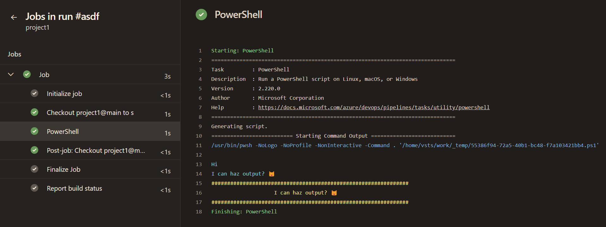
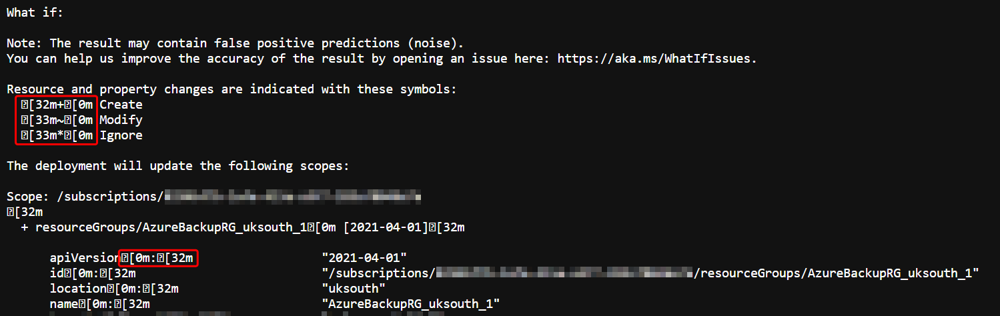
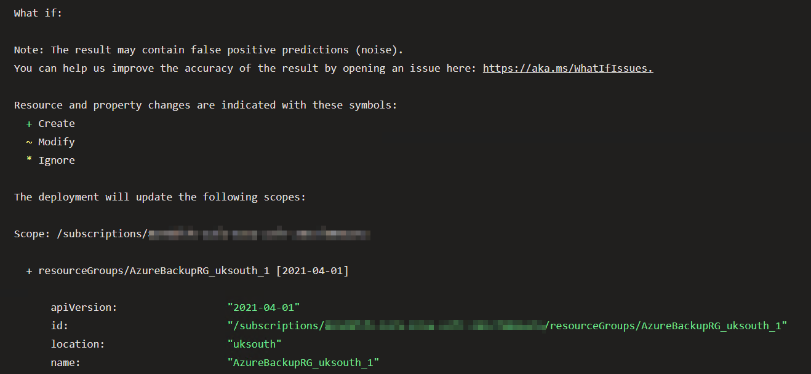

# Azure DevOps ANSI Colour Coding

**_TL/DR; use ANSI escape codes to enable colour formatting in log outputs for Azure DevOps_**

For quite some time I've been using the 5 in-built logging commands in Azure DevOps to try and get clear and easy to understand output logs. Even though they are handy, I've always found it somewhat limiting. That was until  a colleague asked if there was anything I could do to get the output of PowerShell `-What-If` command to be a bit more clearer, and not show a big block of boring monochrome text. A bit of interweb research and I found that it is possible via ANSI escape codes.

I won't go into the detail of ANSI escape codes, you can find all the boring information you need on Wiki: https://en.wikipedia.org/wiki/ANSI_escape_code

However, the gist of it is;
- Azure DevOps uses 3 and 4-bit depth colour output
- Most used CLI console output uses 8-bit or more

Before I get started, I'd like to link to the source of my learning for this task: https://duffney.io/usingansiescapesequencespowershell/ Give credit where credit is due ...and to save time _not_ regurgitating the same thing. Go have a read.


## Pretty print Write-Output

As mentioned before I was initiatlly using AzDo default logging commands to get some decent [colour](https://learn.microsoft.com/en-us/azure/devops/pipelines/scripts/logging-commands?view=azure-devops&tabs=powershell#formatting-commands); and whilst they're Ok and do the job, the output choice could be better.

```powershell
Write-Host "##[group]Beginning of a group"
Write-Host "##[warning]Warning message"
Write-Host "##[error]Error message"
Write-Host "##[section]Start of a section"
Write-Host "##[debug]Debug text"
Write-Host "##[command]Command-line being run"
Write-Host "##[endgroup]"
```

By using ANSI character codes before and after a block of text you can start/stop the colour sequence, forground and background, using the escape character:

```powershell
`e
```

By referencing the Wiki link you can see what the available codes are for 4-bit colour. So for an example of outputting green text on standard terminal background, the command would be:

```powershell
Write-Output "`e[32mThis is green`e[0m"
```

In simple terms `32` is the colour code for green, and `0` is resets any colour codes back to normal terminal settings. Thus the words `This is green` in-between is printed in green.

Now as handy it is to see the colour output in AzDo, it's a pain to have to remember the colour and the command sequence each time you want something pretty; and your code would look so fugly that you just wouldn't want to write it. This is where a custom function comes in handy.

```powershell
function Write-OutputColour {
    [CmdletBinding()]
    param(
        # the colour to output the text as
        [Parameter(Mandatory=$true, Position=1)]
        [ValidateSet('Blue','Cyan', 'Green', 'Magenta', 'Red', 'Yellow')]
        [ValidateNotNullOrEmpty()]
        [string]$Colour,

        # the text for which the colour will be applied
        [Parameter(Mandatory=$true, Position=2)]
        [ValidateNotNullOrEmpty()]
        [string]$String
    )

    switch($Colour) {
        "Blue"    { $printColour = "`e[34m" }
        "Cyan"    { $printColour = "`e[36m" }
        "Green"   { $printColour = "`e[32m" }
        "Magenta" { $printColour = "`e[35m" }
        "Red"     { $printColour = "`e[31m" }
        "Yellow"  { $printColour = "`e[33m" }
    }

    $newString = $String.Replace("`n", "`n${printColour}")

    Write-Output "${printColour}${newString}`e[0m"
}
```

You may notice the function has a replace method on escaping newline characters. Unfortunately that's because AzDo, as far as I can tell, reads outputs line by line; so if you have some coloured text that goes across multiple lines, you need to enable the colour on each start of the newline.

As long as you load that function into your script, whether it be written inside the script or a separate module referenced, then you can write colour outputs with ease:

```powershell
Write-OutputColour Cyan "`nHi`nI can haz output? 😺"

Write-OutputColour Yellow "###############################################################"
Write-OutputColour Yellow "                    I can haz output? 😺"
Write-OutputColour Yellow "###############################################################"
```




## Downsampling to 4-bit

All this colour output is great, but it doesn't help with the original problem of getting the output of a `-What-If` command to be more readable. The problem is that the output of `-What-If` is in 8-bit colour, and AzDo only supports 4-bit. So we need to downsample the colour to 4-bit. This will also be the same for any other 8-bit colour output, such as `Terraform` commands, but for this example I'm going to use `-What-If`.

Unfortunately the `New-AzSubscriptionDeployment` output prints directly to the console (host) and the coloured output cannot be captured by a variable. However, we can execute PowerShell (pwsh) by passing in the command and its values, and then use the output from the command execution.

The first thing to do is to get the output of the `-What-If` command into a variable, so that we can manipulate it. We then use a simple PowerShell regex "replace" that command allows us to swap the RAW output code format of 8-bit ANSI characters into 4-bit. This is where the Wiki link comes in handy again, as it has a table of 8-bit colour codes. So we can use the following code to replace the 8-bit colour codes with the 4-bit equivalent:

type      | 8 bit         | colour | 4 bit
--------- | ------------- | ------ | ------
delete    | `[38;5;208m`  | red    | `[31m`
create    | `[38;5;77m`   | green  | `[32m`
modify    | `[38;5;141m`  | yellow | `[33m`
no effect | `[38;5;246m`  | blue   | `[33m`

```powershell
$getOutput = pwsh -Command @'
New-AzSubscriptionDeployment `
    -DeploymentDebugLogLevel      "All" `
    -Location                     "uksouth" `
    -SkipTemplateParameterPrompt `
    -TemplateFile                 "./template.json" `
    -TemplateParameterObject      (Get-Content -Path "params.json" | ConvertFrom-Json -AsHashtable -Depth 100) `
    -WhatIf
'@

$getOutput `
    -replace "\[38;5;208m", "[31m" `
    -replace "\[38;5;77m" , "[32m" `
    -replace "\[38;5;141m", "[33m" `
    -replace "\[38;5;246m", "[33m"
```

As you can see above, I'm just chaining the replace commands together. I found if you tried to use the PowerShell Replace method or do the command individually it doesn't work. I'm not yet sure why, but I'm sure there's a reason that I can't be bothered to look into ...yet.

### What-If Output

Below are two snippets of the output from the `-What-If` command. The first is the log RAW output, and the second is the output after the 8-bit colour codes have been replaced with 4-bit. Take note of the escape character at the start and end of the text; notice that some lines reset the code at the begininng, set a new colour code immediately after, but do not reset it again. If it wasn't for AzDo treating each line as a new line, the sequence would just continue on the next line, and the colour output would resemeble that of local terminal output. However, since AzDo treats each line output as a new line it won't show the colour output to match exactly that of local terminal output. I'm sure there might be some ways around this, but I haven't found any yet, nor have I looked into it.






## What About Bash?

Yes, Bash. Since I haven't been using Bash for my projects recently, I haven't fully looked into it. But I do now it follows the same principals, and here are some examples to get you started. Notice the use of the `-e` to enable interpretation of the following backslash escapes, where `\e` is the escape character for Bash.

```bash
echo -e "\e[31mThis is red\e[0m"
echo -e "\e[32mThis is green\e[0m"
```


## Conclusion

I hope this helps you with your AzDo pipelines, and if you have any questions or suggestions please let me know. I'm always looking to improve my scripts and knowledge, so any feedback is welcome.
